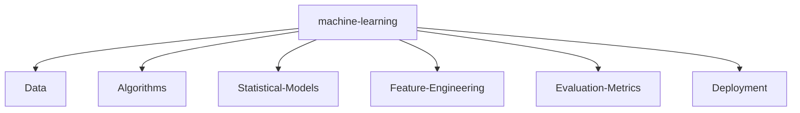

<!--   my-icons -->

    
    
    
    
    
    
       

<!--   my-header-img -->

[中文版本](README-zh.md) &nbsp;&nbsp;&nbsp;&nbsp;&nbsp;&nbsp; [英文版本](README.md)  

<!--   my-ticker -->    

<!--   my-kaggle     
### My achievements on [kaggle](https://www.kaggle.com/andrej0marinchenko):

-->

<!--   my-skils -->

| 属性                      | 数据                                                         |
| ------------------------- | ------------------------------------------------------------ |
| **语言 / IDE**            |       |
| **领域知识**              |     |
| **CI / CD**               |    |
| **数据库**                |   |
| **操作系统**              |   |
| **工具和平台**            |     |
| **机器学习/深度学习框架** | ![Jupyter Notebook](http://img.shields.io/badge/-Jupyter%20Notebook-eee?style=flat-square&logo=data:image/png;base64,iVBORw0KGgoAAAANSUhEUgAAAA4AAAAQCAMAAAARSr4IAAACGVBMVEVhYmJdYWT/fBfzdyaqdlV2dnfcdC9udnz5dyKUaU3wdicCO2CzZzVdUkpOTk5MTk60ZzUAAP/XcC3fcivgciv/lArAajLqdSifYjrydyajnJjEjWifnp3FjGcAAACenp52dnd2dnd2dndhYmJhYmIxW3bzdybzdybzdybzdybzdyb/dxpydnl2dnd2dndhYmJgYmOda0r0dyXzdybzdybzdybudymQdmZldoJQYGmRaU7ydyfzdybzdybzdybzdybzdybzdybzdyb1dyX9dx/2dyXzdybzdybzdyb+eiPzdybzdybzdyb/ghz8eSQ3SFT/tABNTk5HTFBMTk5OTk5OTk5OTk5OTk5OTk5OTk5OTk5OTk5NTk5GTFBOTk5OTk5OTk5OTk5OTk5OTk5OTk5OTk5OTk5OTk5OTk5OTk5OTk5OTk5OTk5NTk5OTk5OTk5OTk5OTk5OTk5OTk5OTk5OTk5NTk5NTk5UUEx5WUMAOGRMTU9OTk5OTk5OTk5OTk5OTk5FTFAXQFvBajK8aTP2eCX0dyb0dyb0dybzdyb4eCXzdybzdybzdybzdybzdybzdybzdybzdybzdyb6dB3zdyXzdybzdybzdybzdybzdybzdybzdyaenp6cn6HKimD0dyXzdybzdybzdybzdybzdybzdyaenp6enp6dn6Dzdybzdyaenp6enp6enp6enp7zdyaenp7///9F1GYlAAAAsHRSTlMAAAAAAAAAAAAAAAAAAAAAAAAAAAAAAAAAAAAAAAAAADHCVho4Ax1RcnFOFz/ibFmwHXPc/thwKwkKJpfbqn1oaX+uighRdSIDAyV6TAQcAgIVHBMbKjIgEzBTHCsbLUBdQlhiTWBlR1xkaEVIR1tPbFEvF0pJNR9AFAQIMwgfKQUDBwgDBEsuMkcCLLSUKBsqT5iwNcX47N/g7cAxPmUqZq/OzaxiExPJYgQPCJjcP9lVnrgAAAClSURBVAjXVcyxSoIBAEXh+xkhEkFr6hD0AM5BkbQ3ODaEY4uDSENCS1BThI/h4v4TERG0NzZHvoAQ0SDV8FvkmS6cw5UgSTR5s83rlgUvWuA8l/Bs59eYbXhS28VdUt1H4dA9Eu1HexUdS3T/7Y81vXJ9rQicLcxoAK64hvd1fWwOeDgoy+JW3bCs56tOonnxd3ycGKt9nt7I91GShgn60yRJI/kBP8EfEEdOa6sAAAAASUVORK5CYII=&logoColor=F37626)    |

<!--   GitHub stats graph -->
### 📈 GitHub活动图:

| .                                                            | .                                                            |
| ------------------------------------------------------------ | ------------------------------------------------------------ |
|  |  |

   &nbsp;&nbsp;&nbsp;&nbsp;&nbsp;&nbsp;&nbsp;&nbsp;&nbsp;&nbsp;&nbsp;&nbsp;
  

<!--   skyline  -->

<!--  2d history skills -->

<!-- </img> -->

**📫 联系我:**

<a href="mailto:yanxing1137@gmail.com" target="blank">  谷歌邮箱联系</a>

Github Profile奖杯

 

   <!--machine-learning-->

 

#### 感谢您的观看 :heart:

 
  

本栏目的访问人数从2023年8月2日起统计
  
<a href="https://info.flagcounter.com/SsYf"> 访问者来自这里哟~ </a>

### 主页概要视图
本栏目的访问人数从2023年8月2日起统计

 

[MIT](LICENSE)

---
  *如果你喜欢我的个人资料，你可以点击⭐进行收藏，如果你想使用这个模板，你可以Fork它，可以使用* 
---
你愿意见见我吗?

如果您想为我的任何存储库做出贡献，请随时提交pr，问题并给我发电子邮件。如果你想和我见面，谈谈建议和想法，请选择一个时间——但一定要描述一下议程

---
  *我用的是自动订阅控制系统。因此，每个订阅我的人，我都会订阅并回复，反之亦然，我将把所有不订阅我的人从应该关注的人中删除。* 
---

原作者：[Andrej Marinchenko](https://github.com/BEPb)

